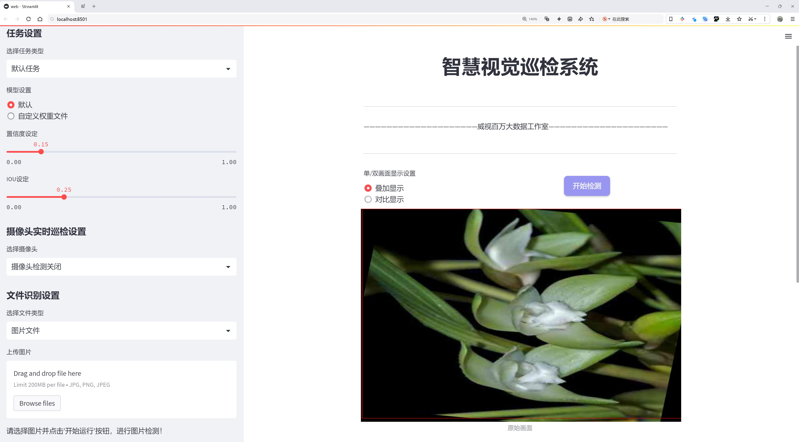
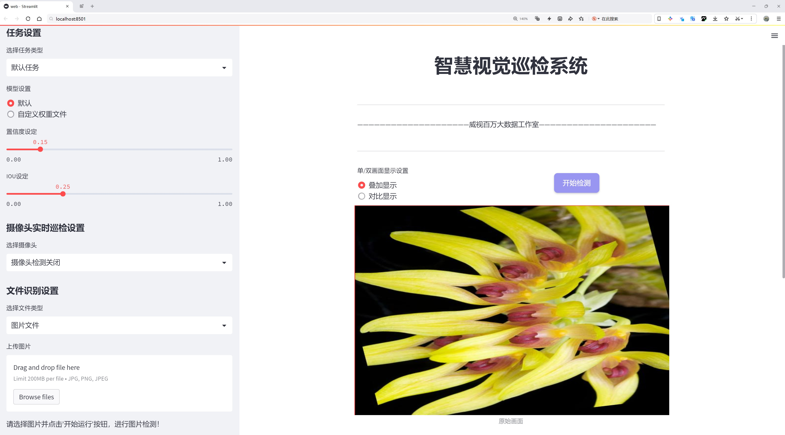
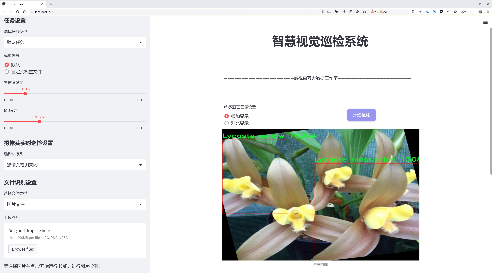
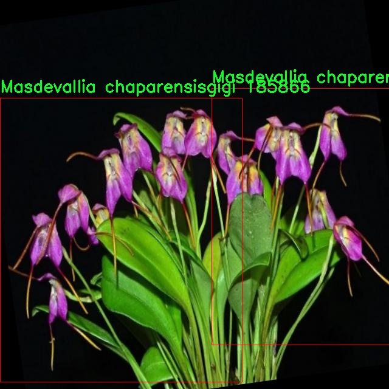
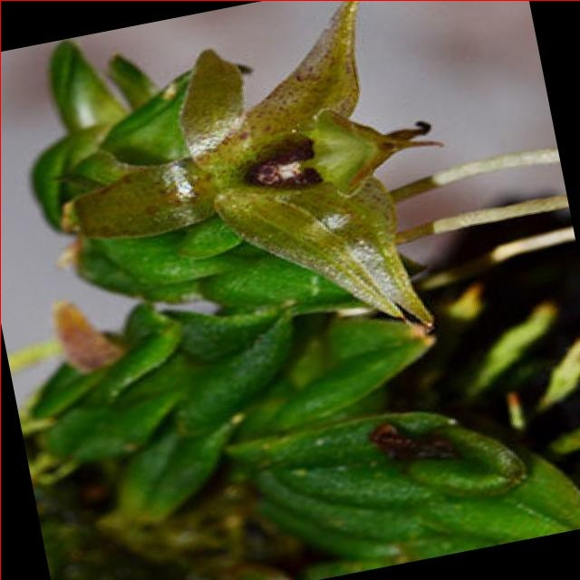
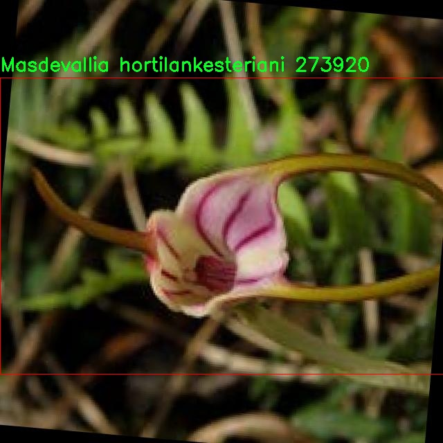
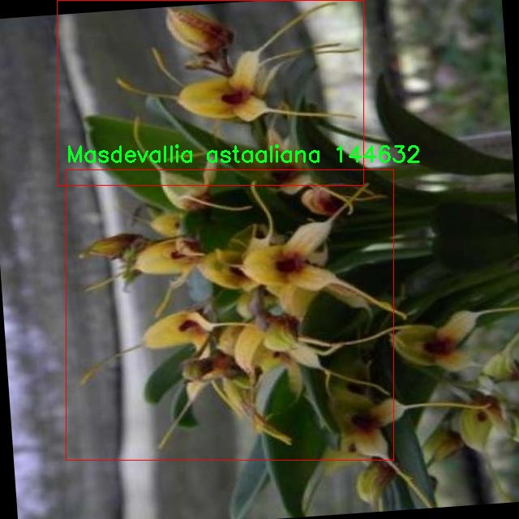
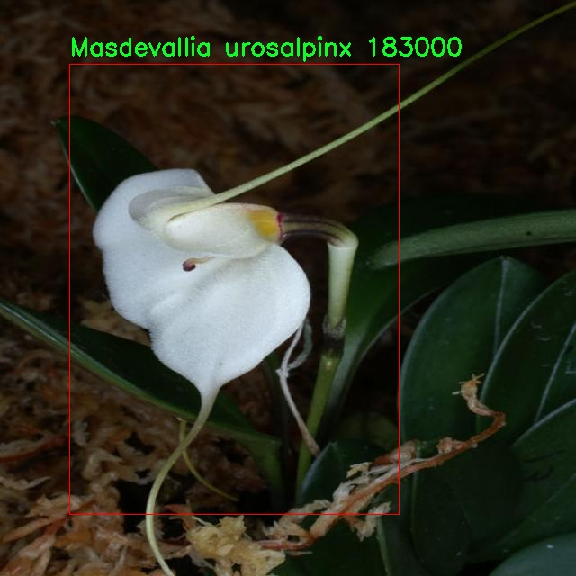

# 兰花种类识别检测系统源码分享
 # [一条龙教学YOLOV8标注好的数据集一键训练_70+全套改进创新点发刊_Web前端展示]

### 1.研究背景与意义

项目参考[AAAI Association for the Advancement of Artificial Intelligence](https://gitee.com/qunshansj/projects)

项目来源[AACV Association for the Advancement of Computer Vision](https://gitee.com/qunmasj/projects)

研究背景与意义

兰花作为一种美丽而多样的植物，因其独特的花形和丰富的色彩而受到广泛的喜爱。尤其是在热带地区，兰花的种类繁多，生长环境复杂，成为了生物多样性研究的重要对象。随着人们对兰花的关注度不断提升，兰花的种类识别与分类变得愈发重要。传统的兰花识别方法主要依赖于植物学家的经验和人工观察，这不仅耗时耗力，而且容易受到主观因素的影响，导致识别的准确性和效率都受到限制。因此，开发一种高效、准确的兰花种类识别系统显得尤为必要。

近年来，深度学习技术的快速发展为图像识别领域带来了革命性的变化。YOLO（You Only Look Once）系列模型因其高效的实时目标检测能力而受到广泛应用。YOLOv8作为该系列的最新版本，结合了更为先进的网络结构和算法，具备了更强的特征提取能力和更快的处理速度。因此，基于改进YOLOv8的兰花种类识别系统的研究，能够有效提升兰花识别的准确性和效率，为兰花的保护与研究提供有力支持。

本研究所使用的数据集“Flower orchid Endemik Papua”包含1800张图像，涵盖260个不同的兰花种类。这一数据集的丰富性为模型的训练和测试提供了坚实的基础。通过对该数据集的深入分析和处理，可以有效提高模型对不同兰花种类的识别能力。此外，数据集中包含的多样化兰花种类，不仅有助于模型的泛化能力提升，也为后续的研究提供了广泛的应用场景。

兰花的种类识别不仅具有学术研究的价值，还具有重要的生态保护意义。随着全球气候变化和人类活动的影响，许多兰花种类面临着生存威胁。通过建立高效的兰花识别系统，可以为兰花的保护和恢复提供科学依据，帮助相关机构制定有效的保护措施。同时，该系统也可以为兰花的商业种植和市场推广提供数据支持，促进兰花产业的可持续发展。

综上所述，基于改进YOLOv8的兰花种类识别系统的研究，不仅能够推动计算机视觉和深度学习技术在植物识别领域的应用，也为兰花的保护与研究提供了新的思路和方法。通过这一研究，期望能够为兰花的多样性保护和生态环境的可持续发展贡献一份力量。

### 2.图片演示







##### 注意：由于此博客编辑较早，上面“2.图片演示”和“3.视频演示”展示的系统图片或者视频可能为老版本，新版本在老版本的基础上升级如下：（实际效果以升级的新版本为准）

  （1）适配了YOLOV8的“目标检测”模型和“实例分割”模型，通过加载相应的权重（.pt）文件即可自适应加载模型。

  （2）支持“图片识别”、“视频识别”、“摄像头实时识别”三种识别模式。

  （3）支持“图片识别”、“视频识别”、“摄像头实时识别”三种识别结果保存导出，解决手动导出（容易卡顿出现爆内存）存在的问题，识别完自动保存结果并导出到tempDir中。

  （4）支持Web前端系统中的标题、背景图等自定义修改，后面提供修改教程。

  另外本项目提供训练的数据集和训练教程,暂不提供权重文件（best.pt）,需要您按照教程进行训练后实现图片演示和Web前端界面演示的效果。

### 3.视频演示

[3.1 视频演示](https://www.bilibili.com/video/BV1UQtaevESZ/)

### 4.数据集信息展示

##### 4.1 本项目数据集详细数据（类别数＆类别名）

nc: 194
names: ['Anggrek hitam', 'Bipinnula', 'Cattleya Mossiae', 'Cymbidium', 'Dendrobium', 'Encyclia', 'Encyclia bractescens', 'Encyclia cordigera', 'Epidendrum coriifolium', 'Epidendrum nocturnum', 'Lycaste', 'Lycaste aromatica', 'Lycaste dowia', 'Lycaste macrobulbon', 'Lycaste macrophylla', 'Lycaste niesseniae', 'Lycaste skinnerii', 'Lycaste yellow', 'Mandesvallia Cherly', 'Mandesvallia basicosdelaorquidea', 'Mandesvallia corniculata', 'Mandesvallia deformis', 'Mandesvallia fenestrellata', 'Mandesvallia infacta', 'Mandesvallia morochoi', 'Masdevallia Adda', 'Masdevallia Aops klabochorum', 'Masdevallia Aquarius', 'Masdevallia Charisma', 'Masdevallia Civilis', 'Masdevallia Constricta', 'Masdevallia EchoOrquidea Peru', 'Masdevallia Falcata', 'Masdevallia Fillaria', 'Masdevallia Heathii', 'Masdevallia Hincksiae', 'Masdevallia Hirasaki', 'Masdevallia Hybrid Orangerot', 'Masdevallia Macchu pichu', 'Masdevallia Marguirite', 'Masdevallia Measurianagrande', 'Masdevallia Mejiana', 'Masdevallia Minsai', 'Masdevallia Monarch', 'Masdevallia Ovalenciae', 'Masdevallia Paivaeana', 'Masdevallia Plant', 'Masdevallia Rassi', 'Masdevallia Redwing', 'Masdevallia Rolfeana', 'Masdevallia RoseMary grande', 'Masdevallia Rosea', 'Masdevallia Sernae', 'Masdevallia Silver star', 'Masdevallia Sunset Jaguar', 'Masdevallia Uniflora', 'Masdevallia Ventricosa', 'Masdevallia Vin Rouge', 'Masdevallia Wild child', 'Masdevallia acrohordonia', 'Masdevallia agaster', 'Masdevallia amabilis', 'Masdevallia amabilisf Red grande', 'Masdevallia analee boyyet', 'Masdevallia angowland', 'Masdevallia astaaliana', 'Masdevallia attenuata large', 'Masdevallia attenuta grande', 'Masdevallia barleaena', 'Masdevallia bennetti', 'Masdevallia bicolor', 'Masdevallia caudata', 'Masdevallia chaparensisgigi', 'Masdevallia chasei', 'Masdevallia cloesii', 'Masdevallia copperwing', 'Masdevallia corderoana', 'Masdevallia cyclotega', 'Masdevallia decumana', 'Masdevallia deniseana', 'Masdevallia dynastes', 'Masdevallia empus', 'Masdevallia erinacea', 'Masdevallia estradae', 'Masdevallia eumeliae', 'Masdevallia fenestrellata', 'Masdevallia fensterbank', 'Masdevallia fireoflifel', 'Masdevallia flores', 'Masdevallia glandulosa colombia', 'Masdevallia goettfertiana', 'Masdevallia grandulosa', 'Masdevallia heleura', 'Masdevallia herradurae', 'Masdevallia hortensiae', 'Masdevallia hortilankesteriani', 'Masdevallia hybrid heiko koehrerwagner', 'Masdevallia ignea Zebra', 'Masdevallia infracta', 'Masdevallia kaledoscope', 'Masdevallia karelii', 'Masdevallia laucheanaI', 'Masdevallia lienzo', 'Masdevallia locusta', 'Masdevallia lucernula', 'Masdevallia masanglifera', 'Masdevallia maslineolata', 'Masdevallia mezae', 'Masdevallia minuta', 'Masdevallia misassiiespecie endemica deSantander HolguerLopez', 'Masdevallia nidifica', 'Masdevallia norae', 'Masdevallia notosbirica', 'Masdevallia orquidea', 'Masdevallia pachyura', 'Masdevallia patricina', 'Masdevallia pinocchio', 'Masdevallia polysticta', 'Masdevallia prince', 'Masdevallia purpurella', 'Masdevallia regina', 'Masdevallia reichenbachianasam transcience', 'Masdevallia roseogena', 'Masdevallia sceptrum', 'Masdevallia schroderiana', 'Masdevallia striatella', 'Masdevallia tattianae', 'Masdevallia terborchii', 'Masdevallia theleura', 'Masdevallia tovarensis', 'Masdevallia triangularis', 'Masdevallia triangularis-royalbotanic garden edinburghscience', 'Masdevallia tridens', 'Masdevallia urosalpinx', 'Masdevallia veitchiana', 'Masdevallia weberbaueri', 'Masdevalliaangulata', 'Masdevalliafloribunda grande', 'Masdevalliaherradurae grande', 'Masdevalliasugar baby', 'Massdevallia Anai', 'Massdevallia citrinella', 'Massdevallia teaguei', 'Massdevalliaprincecharming okika', 'Msdevallia steno Hawaiian Sunset', 'Phalaenopsis Mariposa', 'Phalaenopsis Royal pink', 'Phalaenopsis Schilleriana', 'Phalaenopsis Square', 'Phalaenopsis amaranthpink', 'Phalaenopsis bellina green', 'Phalaenopsis blanca', 'Phalaenopsis bloomthis', 'Phalaenopsis cestablanco', 'Phalaenopsis cuidados', 'Phalaenopsis doublestemp', 'Phalaenopsis equestris blue', 'Phalaenopsis florist white', 'Phalaenopsis fuscia', 'Phalaenopsis hibrida', 'Phalaenopsis holombra', 'Phalaenopsis kokedama', 'Phalaenopsis lindenii', 'Phalaenopsis multi colored', 'Phalaenopsis orquidea', 'Phalaenopsis orquidea ovejita', 'Phalaenopsis palens', 'Phalaenopsis spray purple', 'Phalaenopsis wond', 'Phalaenopsisorquidea tallos', 'Vanilla Antennifera', 'Vanilla Chamissonis', 'Vanilla Connie', 'Vanilla Dilloniana', 'Vanilla Hawaii', 'Vanilla Planifolia', 'Vanilla Planifolia white', 'Vanilla Pompona', 'Vanilla Seychelles', 'Vanilla Vine', 'Vanilla bourbon', 'epidendrum', 'epidendrum calanthum', 'epidendrum centropetalum', 'epidendrum longirepens', 'masdevallia antonii', 'masdevallia bonplandii currlin orchideen', 'masdevallia coccinea', 'masdevallia coccineapink', 'masdevallia ignea', 'masdevallia stripis', 'masdevallia velella', 'masdevallia-coccineablanca terriwinkler', 'masdevalliayungasensis']


##### 4.2 本项目数据集信息介绍

数据集信息展示

本数据集名为“Flower orchid Endemik Papua”，专为改进YOLOv8的兰花种类识别系统而设计。该数据集包含194个不同的兰花种类，涵盖了广泛的品种和变种，体现了兰花的多样性和复杂性。每一种兰花都在其特定的生态环境中生长，具有独特的形态特征和生长习性，这使得它们在植物分类和识别任务中成为了一个极具挑战性的对象。

数据集中包含的兰花种类包括但不限于：Anggrek hitam、Bipinnula、Cattleya Mossiae、Cymbidium、Dendrobium、Encyclia及其多个变种等。这些种类的兰花不仅在外观上各具特色，且在生态适应性、花期和栽培条件等方面也存在显著差异。例如，Cattleya Mossiae以其鲜艳的花色和优雅的花形而受到广泛喜爱，而Dendrobium则因其适应性强、易于栽培而成为许多园艺爱好者的首选。

数据集中的每一类兰花都配有高质量的图像，图像来源于不同的生长环境和光照条件，确保了数据的多样性和代表性。这些图像经过精心标注，包含了丰富的细节信息，如花瓣的形状、颜色、纹理等，旨在为YOLOv8模型的训练提供充分的视觉信息。这种细致的标注不仅有助于模型学习兰花的外观特征，还能提高其在实际应用中的识别准确性。

在实际应用中，改进后的YOLOv8模型将能够快速而准确地识别出不同种类的兰花，帮助研究人员和爱好者更好地了解和保护这些珍贵的植物资源。随着兰花种类的不断增加和栖息地的不断变化，建立一个高效的识别系统显得尤为重要。该数据集的丰富性和多样性为实现这一目标奠定了坚实的基础。

此外，数据集还包含了一些较为罕见的兰花种类，如Masdevallia系列中的多个变种。这些罕见种类的存在不仅增加了数据集的复杂性，也为模型的泛化能力提供了挑战。通过对这些特殊种类的学习，模型将能够在更广泛的环境中进行有效的识别，提升其在实际应用中的表现。

总之，“Flower orchid Endemik Papua”数据集不仅为兰花种类的识别提供了丰富的视觉素材，还为改进YOLOv8模型的训练提供了必要的支持。随着对兰花种类的深入研究和技术的不断进步，该数据集将为植物学、生态学及相关领域的研究提供重要的参考价值，助力兰花保护和可持续发展。











### 5.全套项目环境部署视频教程（零基础手把手教学）

[5.1 环境部署教程链接（零基础手把手教学）](https://www.ixigua.com/7404473917358506534?logTag=c807d0cbc21c0ef59de5)


[5.2 安装Python虚拟环境创建和依赖库安装视频教程链接（零基础手把手教学）](https://www.ixigua.com/7404474678003106304?logTag=1f1041108cd1f708b01a)

### 6.手把手YOLOV8训练视频教程（零基础小白有手就能学会）

[6.1 手把手YOLOV8训练视频教程（零基础小白有手就能学会）](https://www.ixigua.com/7404477157818401292?logTag=d31a2dfd1983c9668658)

### 7.70+种全套YOLOV8创新点代码加载调参视频教程（一键加载写好的改进模型的配置文件）

[7.1 70+种全套YOLOV8创新点代码加载调参视频教程（一键加载写好的改进模型的配置文件）](https://www.ixigua.com/7404478314661806627?logTag=29066f8288e3f4eea3a4)

### 8.70+种全套YOLOV8创新点原理讲解（非科班也可以轻松写刊发刊，V10版本正在科研待更新）

由于篇幅限制，每个创新点的具体原理讲解就不一一展开，具体见下列网址中的创新点对应子项目的技术原理博客网址【Blog】：


[8.1 70+种全套YOLOV8创新点原理讲解链接](https://gitee.com/qunmasj/good)

### 9.系统功能展示（检测对象为举例，实际内容以本项目数据集为准）

图9.1.系统支持检测结果表格显示

  图9.2.系统支持置信度和IOU阈值手动调节

  图9.3.系统支持自定义加载权重文件best.pt(需要你通过步骤5中训练获得)

  图9.4.系统支持摄像头实时识别

  图9.5.系统支持图片识别

  图9.6.系统支持视频识别

  图9.7.系统支持识别结果文件自动保存

  图9.8.系统支持Excel导出检测结果数据


### 10.原始YOLOV8算法原理

原始YOLOv8算法原理

YOLOv8算法作为目标检测领域的最新进展，基于YOLOv5的架构进行了深度优化与升级，展现出更高的检测精度和更快的推理速度。该算法不仅在结构上进行了创新，还在功能上实现了多种改进，尤其是在轻量化模型的设计上，满足了现代计算环境对效率和性能的双重需求。YOLOv8系列包括五个不同规模的模型：YOLOv8n、YOLOv8s、YOLOv8m、YOLOv8l和YOLOv8x，其中YOLOv8n是最轻量化的版本，适合资源受限的应用场景。

YOLOv8的网络结构主要由三个部分组成：骨干特征提取网络（Backbone）、特征融合层（Neck）和检测头层（Head）。在骨干特征提取网络中，YOLOv8采用了C2F模块来替代传统的C3模块，这一创新使得网络在保持较低复杂度的同时，能够提取到更加丰富的特征信息。C2F模块通过引入更多的残差连接，增强了梯度信息的流动，进而提高了模型的训练效率和性能。

特征融合层的设计是YOLOv8的另一大亮点。该层结合了特征金字塔网络（FPN）和路径聚合网络（PAN）的优点，形成了一个高效的特征融合机制。通过BiFPN网络的引入，YOLOv8能够实现双向跨尺度连接，快速而有效地融合来自不同尺度的特征信息。这种设计不仅提升了模型对不同目标尺度的适应能力，还加快了特征提取的速度，使得YOLOv8在实时检测任务中表现得尤为出色。

在检测头层，YOLOv8采用了轻量化的解耦合头结构，显著改善了目标检测的精度。与传统的耦合头结构不同，解耦合头将分类和回归任务分开处理，进一步提高了模型的灵活性和准确性。此外，YOLOv8在目标检测中引入了无锚点（Anchor-Free）的方法，避免了锚框选择带来的复杂性和不确定性，使得模型在处理复杂场景时更加高效。

YOLOv8在训练过程中采用了一系列先进的数据增强技术，以提升模型的泛化能力。例如，在训练的最后10个epoch中，关闭了马赛克增强，并使用动态任务对齐分配策略（Task-Aligned Assigner）来优化样本分配。这种方法确保了模型在训练过程中能够更好地适应不同的目标检测任务，提高了模型的鲁棒性。

在损失计算方面，YOLOv8引入了BCELoss作为分类损失，同时结合DFLLoss和CIoULoss作为回归损失。这种多重损失函数的设计使得模型在训练过程中能够更好地平衡分类和回归任务，从而提升了整体的检测性能。

总的来说，YOLOv8算法在设计理念上强调了轻量化与高效性，通过对网络结构的精细调整和优化，成功地实现了在复杂环境下的高效目标检测。无论是在工业应用、智能监控还是自动驾驶等领域，YOLOv8都展现出了强大的应用潜力和广泛的适用性。其灵活的模型架构和高效的特征提取能力，使得YOLOv8成为当前目标检测领域的重要里程碑，为后续的研究和应用提供了坚实的基础。


### 11.项目核心源码讲解（再也不用担心看不懂代码逻辑）

#### 11.1 70+种YOLOv8算法改进源码大全和调试加载训练教程（非必要）\ultralytics\utils\errors.py

以下是经过精简和详细注释的核心代码部分：

```python
# Ultralytics YOLO 🚀, AGPL-3.0 license

from ultralytics.utils import emojis  # 导入用于处理表情符号的工具

class HUBModelError(Exception):
    """
    自定义异常类，用于处理与Ultralytics YOLO模型获取相关的错误。

    当请求的模型未找到或无法检索时，将引发此异常。
    异常消息经过处理，以便更好地用户体验。
    """

    def __init__(self, message='Model not found. Please check model URL and try again.'):
        """
        初始化HUBModelError异常。

        参数:
            message (str): 异常消息，默认为'未找到模型。请检查模型URL并重试。'
        """
        super().__init__(emojis(message))  # 调用父类构造函数，并使用emojis函数处理消息
```

### 代码说明：
1. **导入模块**：从`ultralytics.utils`导入`emojis`函数，用于在异常消息中添加表情符号，以增强用户体验。
2. **自定义异常类**：`HUBModelError`类继承自Python内置的`Exception`类，用于表示与模型获取相关的错误。
3. **构造函数**：`__init__`方法接收一个可选的消息参数，默认消息指示模型未找到。该消息经过`emojis`函数处理后传递给父类的构造函数，以便在异常被抛出时显示。

这个文件定义了一个自定义异常类 `HUBModelError`，用于处理与 Ultralytics YOLO 模型获取相关的错误。该异常主要在请求的模型未找到或无法检索时被抛出。

在这个类中，构造函数 `__init__` 接受一个可选的字符串参数 `message`，默认值为“Model not found. Please check model URL and try again.”，这意味着如果没有提供特定的错误信息，系统会使用这个默认信息。构造函数调用了父类 `Exception` 的初始化方法，并通过 `emojis` 函数处理传入的消息，以便在用户体验上添加一些表情符号，使得错误信息更加友好和易于理解。

这个类的设计目的是提高代码的可读性和用户体验，确保在模型加载失败时，用户能够收到清晰且易于理解的错误提示。通过使用 `emojis` 函数，错误信息不仅仅是文本，还能通过表情符号传达情感，使得调试过程更加轻松。

#### 11.2 ui.py

```python
import sys
import subprocess

def run_script(script_path):
    """
    使用当前 Python 环境运行指定的脚本。

    Args:
        script_path (str): 要运行的脚本路径

    Returns:
        None
    """
    # 获取当前 Python 解释器的路径
    python_path = sys.executable

    # 构建运行命令，使用 streamlit 运行指定的脚本
    command = f'"{python_path}" -m streamlit run "{script_path}"'

    # 执行命令并等待其完成
    result = subprocess.run(command, shell=True)
    
    # 检查命令执行的返回码，如果不为0则表示出错
    if result.returncode != 0:
        print("脚本运行出错。")


# 实例化并运行应用
if __name__ == "__main__":
    # 指定要运行的脚本路径
    script_path = "web.py"  # 这里可以直接指定脚本名称

    # 调用函数运行脚本
    run_script(script_path)
```

### 代码注释说明：

1. **导入模块**：
   - `sys`：用于访问与 Python 解释器紧密相关的变量和函数。
   - `subprocess`：用于生成新的进程、连接到它们的输入/输出/错误管道，并获得它们的返回码。

2. **`run_script` 函数**：
   - 该函数接受一个脚本路径作为参数，并在当前 Python 环境中运行该脚本。
   - 使用 `sys.executable` 获取当前 Python 解释器的路径，以确保使用正确的 Python 环境。
   - 构建命令字符串，使用 `streamlit` 模块运行指定的脚本。
   - 使用 `subprocess.run` 执行命令，并等待其完成。
   - 检查命令的返回码，如果返回码不为0，表示脚本运行出错，并打印错误信息。

3. **主程序部分**：
   - 使用 `if __name__ == "__main__":` 确保该部分代码仅在脚本作为主程序运行时执行。
   - 指定要运行的脚本路径（在这里是 `web.py`）。
   - 调用 `run_script` 函数来执行指定的脚本。

这个程序文件名为 `ui.py`，其主要功能是通过当前的 Python 环境来运行一个指定的脚本。代码首先导入了必要的模块，包括 `sys`、`os` 和 `subprocess`，以及一个自定义的路径处理模块 `abs_path`。

在 `run_script` 函数中，首先定义了一个参数 `script_path`，用于接收要运行的脚本的路径。函数内部首先获取当前 Python 解释器的路径，存储在 `python_path` 变量中。接着，构建一个命令字符串，该命令使用 `streamlit` 模块来运行指定的脚本。这个命令通过 `subprocess.run` 方法执行，`shell=True` 允许在 shell 中执行命令。

如果脚本运行过程中出现错误，`result.returncode` 将不等于 0，程序会打印出“脚本运行出错”的提示信息。

在文件的最后部分，使用 `if __name__ == "__main__":` 语句来确保只有在直接运行该文件时才会执行后面的代码。这里指定了要运行的脚本路径为 `web.py`，并调用 `run_script` 函数来执行这个脚本。

整体来看，这个程序的主要作用是封装了一个通过 Python 环境运行 Streamlit 脚本的功能，便于用户在命令行中快速启动一个基于 Streamlit 的 Web 应用。

#### 11.3 70+种YOLOv8算法改进源码大全和调试加载训练教程（非必要）\ultralytics\nn\extra_modules\rep_block.py

以下是代码中最核心的部分，并附上详细的中文注释：

```python
import torch
import torch.nn as nn
import torch.nn.functional as F

# 定义一个用于处理卷积和批归一化的模块
def conv_bn(in_channels, out_channels, kernel_size, stride=1, padding=0, dilation=1, groups=1):
    # 创建卷积层，不使用偏置
    conv_layer = nn.Conv2d(in_channels=in_channels, out_channels=out_channels, kernel_size=kernel_size,
                           stride=stride, padding=padding, dilation=dilation, groups=groups,
                           bias=False)
    # 创建批归一化层
    bn_layer = nn.BatchNorm2d(num_features=out_channels, affine=True)
    # 将卷积层和批归一化层组合成一个顺序容器
    return nn.Sequential(conv_layer, bn_layer)

# 定义DiverseBranchBlock类，继承自nn.Module
class DiverseBranchBlock(nn.Module):
    def __init__(self, in_channels, out_channels, kernel_size, stride=1, padding=None, dilation=1, groups=1):
        super(DiverseBranchBlock, self).__init__()
        
        # 设置一些基本参数
        self.kernel_size = kernel_size
        self.out_channels = out_channels
        self.groups = groups
        
        # 自动计算填充
        if padding is None:
            padding = kernel_size // 2
        
        # 定义原始卷积和批归一化模块
        self.dbb_origin = conv_bn(in_channels=in_channels, out_channels=out_channels, kernel_size=kernel_size,
                                  stride=stride, padding=padding, dilation=dilation, groups=groups)

        # 定义平均池化和批归一化模块
        self.dbb_avg = nn.Sequential(
            nn.AvgPool2d(kernel_size=kernel_size, stride=stride, padding=0),
            nn.BatchNorm2d(out_channels)
        )

        # 定义1x1卷积模块
        self.dbb_1x1_kxk = nn.Sequential(
            nn.Conv2d(in_channels=in_channels, out_channels=out_channels, kernel_size=kernel_size, stride=stride,
                      padding=0, groups=groups, bias=False),
            nn.BatchNorm2d(out_channels)
        )

    def forward(self, inputs):
        # 前向传播
        out = self.dbb_origin(inputs)  # 通过原始卷积和批归一化
        out += self.dbb_avg(inputs)     # 加上平均池化和批归一化的输出
        out += self.dbb_1x1_kxk(inputs) # 加上1x1卷积的输出
        return out  # 返回最终的输出
```

### 代码说明：
1. **conv_bn** 函数：这个函数创建一个包含卷积层和批归一化层的顺序模块。卷积层的偏置被设置为 `False`，因为批归一化层会处理偏置。

2. **DiverseBranchBlock 类**：这是一个自定义的神经网络模块，继承自 `nn.Module`。它包含多个分支，分别通过不同的卷积和池化操作处理输入。

   - **初始化方法**：在初始化时，设置输入和输出通道数、卷积核大小、步幅、填充、扩张率和分组数。根据输入参数创建不同的卷积和池化层。

   - **forward 方法**：实现前向传播逻辑，依次通过原始卷积、平均池化和1x1卷积处理输入，并将它们的输出相加，最终返回结果。

这个模块的设计允许在不同的分支上进行多种卷积操作，从而提高模型的表达能力。

这个程序文件定义了一个名为 `DiverseBranchBlock` 的神经网络模块，主要用于深度学习中的卷积操作，特别是在 YOLOv8 算法的改进中。文件中使用了 PyTorch 框架，包含了多个辅助函数和类，来实现不同的卷积和归一化操作。

首先，文件导入了必要的库，包括 `torch` 和 `torch.nn`，并定义了一些用于卷积和归一化的辅助函数。例如，`transI_fusebn` 函数用于将卷积核和批归一化层的参数融合，以便于后续的计算。其他转换函数如 `transII_addbranch`、`transIII_1x1_kxk` 等，分别实现了不同的卷积操作和参数处理。

接下来，定义了 `conv_bn` 函数，用于创建一个包含卷积层和批归一化层的序列模块。`IdentityBasedConv1x1` 类是一个特殊的卷积层，主要用于实现带有身份映射的 1x1 卷积，确保在特定条件下的特征传递。

`BNAndPadLayer` 类则结合了批归一化和填充操作，允许在卷积操作后进行适当的边界处理，以保持特征图的尺寸一致。

`DiverseBranchBlock` 类是文件的核心部分，它实现了多分支卷积块的功能。该类的构造函数接受多个参数，包括输入和输出通道数、卷积核大小、步幅、填充、扩张率和分组数等。根据输入参数的不同，模块可以选择不同的卷积和归一化结构。

在 `forward` 方法中，定义了前向传播的具体操作。根据是否存在重新参数化的卷积层，模块会选择不同的路径进行计算。它将多个分支的输出相加，最终通过非线性激活函数输出结果。

此外，类中还定义了一些辅助方法，如 `get_equivalent_kernel_bias` 用于获取等效的卷积核和偏置，`switch_to_deploy` 用于在部署阶段切换到更高效的卷积结构，以及 `init_gamma` 和 `single_init` 用于初始化批归一化层的参数。

整体来看，这个文件实现了一个复杂的卷积模块，旨在提高 YOLOv8 算法的性能和灵活性，适用于多种计算场景。通过多分支结构，模块能够更好地捕捉特征，提高模型的表达能力。

#### 11.4 train.py

以下是经过简化和注释的核心代码部分，主要关注于YOLO模型的训练过程：

```python
import random
import numpy as np
import torch.nn as nn
from ultralytics.data import build_dataloader, build_yolo_dataset
from ultralytics.engine.trainer import BaseTrainer
from ultralytics.models import yolo
from ultralytics.nn.tasks import DetectionModel
from ultralytics.utils import LOGGER, RANK
from ultralytics.utils.torch_utils import de_parallel, torch_distributed_zero_first

class DetectionTrainer(BaseTrainer):
    """
    基于检测模型的训练类，继承自BaseTrainer类。
    """

    def build_dataset(self, img_path, mode="train", batch=None):
        """
        构建YOLO数据集。

        参数:
            img_path (str): 包含图像的文件夹路径。
            mode (str): 模式，`train`表示训练模式，`val`表示验证模式。
            batch (int, optional): 批次大小，仅用于`rect`模式。默认为None。
        """
        gs = max(int(de_parallel(self.model).stride.max() if self.model else 0), 32)  # 获取模型的最大步幅
        return build_yolo_dataset(self.args, img_path, batch, self.data, mode=mode, rect=mode == "val", stride=gs)

    def get_dataloader(self, dataset_path, batch_size=16, rank=0, mode="train"):
        """构建并返回数据加载器。"""
        assert mode in ["train", "val"]  # 确保模式有效
        with torch_distributed_zero_first(rank):  # 在分布式环境中，确保数据集只初始化一次
            dataset = self.build_dataset(dataset_path, mode, batch_size)
        shuffle = mode == "train"  # 训练模式下打乱数据
        workers = self.args.workers if mode == "train" else self.args.workers * 2  # 根据模式设置工作线程数
        return build_dataloader(dataset, batch_size, workers, shuffle, rank)  # 返回数据加载器

    def preprocess_batch(self, batch):
        """对图像批次进行预处理，包括缩放和转换为浮点数。"""
        batch["img"] = batch["img"].to(self.device, non_blocking=True).float() / 255  # 将图像数据转换为浮点数并归一化
        if self.args.multi_scale:  # 如果启用多尺度训练
            imgs = batch["img"]
            sz = (
                random.randrange(self.args.imgsz * 0.5, self.args.imgsz * 1.5 + self.stride)
                // self.stride
                * self.stride
            )  # 随机选择一个尺寸
            sf = sz / max(imgs.shape[2:])  # 计算缩放因子
            if sf != 1:
                ns = [
                    math.ceil(x * sf / self.stride) * self.stride for x in imgs.shape[2:]
                ]  # 计算新的形状
                imgs = nn.functional.interpolate(imgs, size=ns, mode="bilinear", align_corners=False)  # 调整图像大小
            batch["img"] = imgs
        return batch

    def get_model(self, cfg=None, weights=None, verbose=True):
        """返回YOLO检测模型。"""
        model = DetectionModel(cfg, nc=self.data["nc"], verbose=verbose and RANK == -1)  # 创建检测模型
        if weights:
            model.load(weights)  # 加载权重
        return model

    def plot_training_samples(self, batch, ni):
        """绘制带有注释的训练样本。"""
        plot_images(
            images=batch["img"],
            batch_idx=batch["batch_idx"],
            cls=batch["cls"].squeeze(-1),
            bboxes=batch["bboxes"],
            paths=batch["im_file"],
            fname=self.save_dir / f"train_batch{ni}.jpg",
            on_plot=self.on_plot,
        )

    def plot_metrics(self):
        """从CSV文件中绘制指标。"""
        plot_results(file=self.csv, on_plot=self.on_plot)  # 保存结果图
```

### 代码说明：
1. **构建数据集**：`build_dataset`方法用于构建YOLO数据集，支持训练和验证模式。
2. **数据加载器**：`get_dataloader`方法用于创建数据加载器，确保在分布式训练中只初始化一次数据集。
3. **批处理预处理**：`preprocess_batch`方法对输入的图像批次进行归一化和缩放处理，支持多尺度训练。
4. **模型获取**：`get_model`方法用于返回YOLO检测模型，并可选择性地加载预训练权重。
5. **绘图功能**：`plot_training_samples`和`plot_metrics`方法用于可视化训练样本和训练指标，便于分析训练过程。

这些核心部分构成了YOLO模型训练的基础，确保数据处理、模型构建和结果可视化的有效性。

这个程序文件 `train.py` 是一个用于训练 YOLO（You Only Look Once）目标检测模型的实现，继承自 `BaseTrainer` 类。它包含了多个方法，用于构建数据集、获取数据加载器、预处理图像批次、设置模型属性、获取模型、进行验证、记录损失、输出训练进度、绘制训练样本和绘制训练指标等。

在文件开头，导入了一些必要的库和模块，包括数学库、随机数生成、深度学习相关的库以及 YOLO 模型和数据处理的工具。接着定义了 `DetectionTrainer` 类，该类的主要功能是基于 YOLO 模型进行目标检测的训练。

`build_dataset` 方法用于构建 YOLO 数据集，接收图像路径、模式（训练或验证）和批次大小作为参数。它会根据模型的步幅计算合适的大小，并调用 `build_yolo_dataset` 函数来创建数据集。

`get_dataloader` 方法用于构建并返回数据加载器。它会检查模式是否为训练或验证，并在分布式训练时确保数据集只初始化一次。根据模式的不同，它会设置不同的工作线程数量，并返回构建好的数据加载器。

`preprocess_batch` 方法用于对图像批次进行预处理，包括将图像缩放到适当的大小并转换为浮点数格式。它还支持多尺度训练，通过随机选择图像大小来增强模型的鲁棒性。

`set_model_attributes` 方法用于设置模型的属性，包括类别数量和类别名称。这些信息是从数据集中提取的，并附加到模型中。

`get_model` 方法用于返回一个 YOLO 检测模型，可以选择加载预训练的权重。

`get_validator` 方法返回一个用于验证 YOLO 模型的验证器，并设置损失名称。

`label_loss_items` 方法用于返回带有标签的训练损失项字典，方便后续的损失记录和分析。

`progress_string` 方法返回一个格式化的字符串，显示训练进度，包括当前的轮次、GPU 内存使用情况、损失值、实例数量和图像大小等信息。

`plot_training_samples` 方法用于绘制训练样本及其标注，便于可视化训练过程中的样本质量。

最后，`plot_metrics` 和 `plot_training_labels` 方法分别用于绘制训练指标和创建带标签的训练图，以便分析模型的训练效果。

总体而言，这个文件实现了 YOLO 模型训练的核心功能，涵盖了数据处理、模型构建、训练过程监控和结果可视化等多个方面。

#### 11.5 70+种YOLOv8算法改进源码大全和调试加载训练教程（非必要）\ultralytics\utils\loss.py

以下是经过简化和注释的核心代码部分，主要包含了损失函数的实现，便于理解其工作原理。

```python
import torch
import torch.nn as nn
import torch.nn.functional as F

class BboxLoss(nn.Module):
    def __init__(self, reg_max, use_dfl=False):
        """初始化边界框损失模块，设置最大正则化和DFL选项。"""
        super().__init__()
        self.reg_max = reg_max  # 最大正则化值
        self.use_dfl = use_dfl  # 是否使用分布焦点损失
        self.iou_ratio = 0.5  # IoU比率

    def forward(self, pred_dist, pred_bboxes, anchor_points, target_bboxes, target_scores, target_scores_sum, fg_mask):
        """计算IoU损失和DFL损失。"""
        weight = target_scores.sum(-1)[fg_mask].unsqueeze(-1)  # 计算权重
        iou = bbox_iou(pred_bboxes[fg_mask], target_bboxes[fg_mask], xywh=False, CIoU=True)  # 计算IoU

        # IoU损失
        loss_iou = ((1.0 - iou) * weight).sum() / target_scores_sum
        
        # DFL损失
        if self.use_dfl:
            target_ltrb = bbox2dist(anchor_points, target_bboxes, self.reg_max)  # 将目标框转换为分布格式
            loss_dfl = self._df_loss(pred_dist[fg_mask].view(-1, self.reg_max + 1), target_ltrb[fg_mask]) * weight
            loss_dfl = loss_dfl.sum() / target_scores_sum
        else:
            loss_dfl = torch.tensor(0.0).to(pred_dist.device)  # 如果不使用DFL，损失为0

        return loss_iou, loss_dfl  # 返回IoU损失和DFL损失

    @staticmethod
    def _df_loss(pred_dist, target):
        """计算分布焦点损失。"""
        tl = target.long()  # 目标左边界
        tr = tl + 1  # 目标右边界
        wl = tr - target  # 左边权重
        wr = 1 - wl  # 右边权重
        # 计算左边和右边的交叉熵损失
        return (F.cross_entropy(pred_dist, tl.view(-1), reduction='none').view(tl.shape) * wl +
                F.cross_entropy(pred_dist, tr.view(-1), reduction='none').view(tl.shape) * wr).mean(-1, keepdim=True)

class v8DetectionLoss:
    """计算检测损失的类。"""

    def __init__(self, model):
        """初始化检测损失类，设置模型相关属性和损失函数。"""
        device = next(model.parameters()).device  # 获取模型设备
        m = model.model[-1]  # 获取检测模块
        self.bce = nn.BCEWithLogitsLoss(reduction='none')  # 二元交叉熵损失
        self.bbox_loss = BboxLoss(m.reg_max - 1, use_dfl=True).to(device)  # 初始化边界框损失

    def __call__(self, preds, batch):
        """计算总损失并返回。"""
        loss = torch.zeros(3, device=self.device)  # 初始化损失数组
        pred_bboxes = self.bbox_decode(preds)  # 解码预测的边界框

        # 计算边界框损失
        if batch['fg_mask'].sum():
            loss[0], loss[2] = self.bbox_loss(pred_bboxes, batch['target_bboxes'], batch['target_scores'], batch['fg_mask'])

        # 计算分类损失
        loss[1] = self.bce(preds['scores'], batch['target_scores']).sum() / max(batch['target_scores'].sum(), 1)

        return loss.sum()  # 返回总损失

    def bbox_decode(self, preds):
        """解码预测的边界框。"""
        # 实现解码逻辑
        pass  # 具体实现根据模型而定
```

### 代码注释说明：
1. **BboxLoss 类**：负责计算边界框的损失，包括IoU损失和分布焦点损失（DFL）。在 `forward` 方法中，首先计算IoU，然后根据是否使用DFL来计算相应的损失。
2. **v8DetectionLoss 类**：用于计算检测任务的总损失。初始化时设置损失函数，并在调用时计算边界框损失和分类损失。
3. **损失计算**：损失计算的核心在于如何处理预测值和目标值之间的差异，利用不同的损失函数来优化模型的性能。

以上代码保留了主要的功能逻辑，并通过注释详细解释了每个部分的作用。

这个文件包含了YOLOv8模型中用于计算损失的多个类和函数，主要用于目标检测、分割和姿态估计等任务。文件中定义的损失函数主要是为了优化模型的性能，使其在训练过程中能够更好地拟合数据。

首先，`SlideLoss`和`EMASlideLoss`类实现了滑动损失的计算，这种损失在IoU（Intersection over Union）较低时给予更高的权重，从而帮助模型更好地学习到物体的边界。`SlideLoss`直接使用给定的损失函数，而`EMASlideLoss`则结合了指数移动平均的方法来动态调整IoU的值。

接下来，`VarifocalLoss`和`FocalLoss`类实现了变焦损失和焦点损失。这些损失函数通过调整难易样本的权重来提高模型对小物体或难以分类物体的检测能力。`VarifocalLoss`通过对预测分数和真实分数的加权来计算损失，而`FocalLoss`则通过对交叉熵损失进行调制来实现。

`BboxLoss`类专注于边界框的损失计算，结合了IoU损失和分布焦点损失（DFL）。该类可以根据是否使用DFL来计算损失，DFL是一种新的损失计算方法，可以更好地处理边界框的回归问题。

`KeypointLoss`类用于计算关键点的损失，主要用于姿态估计任务。它通过计算预测关键点与真实关键点之间的欧几里得距离来评估模型的性能。

`v8DetectionLoss`类是YOLOv8的主要损失计算类，整合了边界框损失、分类损失和DFL损失。它还负责处理输入数据，生成锚点，并计算最终的损失值。

`v8SegmentationLoss`和`v8PoseLoss`类分别扩展了`v8DetectionLoss`，用于处理分割和姿态估计任务。它们分别计算分割损失和姿态损失，结合了相应的损失函数和数据处理逻辑。

最后，`v8ClassificationLoss`类用于计算分类任务的损失，使用交叉熵损失函数来评估模型的分类性能。

整体来看，这个文件实现了YOLOv8模型中多种损失函数的计算，旨在通过不同的损失策略来提升模型在目标检测、分割和姿态估计等任务中的表现。

#### 11.6 70+种YOLOv8算法改进源码大全和调试加载训练教程（非必要）\ultralytics\models\yolo\pose\val.py

以下是经过简化和注释的核心代码部分：

```python
# 导入必要的库
from ultralytics.models.yolo.detect import DetectionValidator
from ultralytics.utils import ops
from ultralytics.utils.metrics import PoseMetrics, box_iou, kpt_iou

class PoseValidator(DetectionValidator):
    """
    PoseValidator类用于基于姿态模型的验证，继承自DetectionValidator类。
    """

    def __init__(self, dataloader=None, save_dir=None, args=None):
        """初始化PoseValidator对象，设置参数和属性。"""
        super().__init__(dataloader, save_dir, args=args)
        self.kpt_shape = None  # 关键点形状
        self.metrics = PoseMetrics(save_dir=self.save_dir)  # 初始化姿态度量

    def preprocess(self, batch):
        """预处理批次数据，将关键点数据转换为浮点数并移动到设备上。"""
        batch = super().preprocess(batch)  # 调用父类的预处理方法
        batch['keypoints'] = batch['keypoints'].to(self.device).float()  # 转换关键点数据类型
        return batch

    def postprocess(self, preds):
        """应用非极大值抑制，返回高置信度的检测结果。"""
        return ops.non_max_suppression(preds, self.args.conf, self.args.iou)

    def update_metrics(self, preds, batch):
        """更新度量指标。"""
        for si, pred in enumerate(preds):  # 遍历每个预测结果
            idx = batch['batch_idx'] == si  # 获取当前批次索引
            cls = batch['cls'][idx]  # 获取当前批次的类别
            bbox = batch['bboxes'][idx]  # 获取当前批次的边界框
            kpts = batch['keypoints'][idx]  # 获取当前批次的关键点
            npr = pred.shape[0]  # 当前预测的数量

            if npr == 0:  # 如果没有预测结果
                continue

            # 处理预测结果
            predn = pred.clone()  # 克隆预测结果
            ops.scale_boxes(batch['img'][si].shape[1:], predn[:, :4], batch['ori_shape'][si])  # 缩放边界框

            # 计算IoU
            correct_bboxes = self._process_batch(predn[:, :6], batch['labels'][idx])  # 处理边界框
            correct_kpts = self._process_batch(predn[:, :6], batch['labels'][idx], pred_kpts=predn[:, 6:], gt_kpts=kpts)  # 处理关键点

            # 更新统计信息
            self.stats.append((correct_bboxes, correct_kpts))

    def _process_batch(self, detections, labels, pred_kpts=None, gt_kpts=None):
        """
        处理批次，返回正确的预测矩阵。
        """
        if pred_kpts is not None and gt_kpts is not None:
            iou = kpt_iou(gt_kpts, pred_kpts)  # 计算关键点的IoU
        else:
            iou = box_iou(labels[:, 1:], detections[:, :4])  # 计算边界框的IoU

        return self.match_predictions(detections[:, 5], labels[:, 0], iou)  # 匹配预测结果

```

### 代码注释说明：
1. **导入库**：导入了必要的库和模块，主要用于模型检测和计算度量。
2. **PoseValidator类**：该类继承自`DetectionValidator`，用于姿态模型的验证。
3. **初始化方法**：设置一些基本参数，并初始化姿态度量。
4. **预处理方法**：对输入批次进行预处理，确保关键点数据格式正确并移动到指定设备。
5. **后处理方法**：应用非极大值抑制，筛选出高置信度的检测结果。
6. **更新度量方法**：根据预测结果和真实标签更新度量指标，包括处理边界框和关键点的IoU计算。
7. **处理批次方法**：计算预测结果与真实标签之间的匹配情况，返回正确的预测矩阵。

该程序文件是用于YOLOv8模型的姿态估计验证的Python代码，主要实现了对姿态模型的验证过程。文件中定义了一个名为`PoseValidator`的类，该类继承自`DetectionValidator`，并在其基础上扩展了针对姿态模型的验证功能。

在初始化方法`__init__`中，`PoseValidator`类接收一些参数，包括数据加载器、保存目录、进度条、参数和回调函数。该方法调用了父类的初始化方法，并设置了一些特定于姿态估计的属性，比如`self.sigma`和`self.kpt_shape`。如果设备为Apple的MPS，程序会发出警告，建议使用CPU进行姿态模型的推理。

`preprocess`方法用于对输入批次进行预处理，将关键点数据转换为浮点数并移动到指定设备上。`get_desc`方法返回评估指标的描述信息，便于后续输出结果时的格式化。

在`postprocess`方法中，程序应用非极大值抑制（NMS）来过滤掉低置信度的检测结果。`init_metrics`方法用于初始化姿态估计的指标，确定关键点的形状并设置相应的标准差。

`update_metrics`方法是核心功能之一，它更新模型的评估指标。该方法处理每个批次的预测结果和真实标签，计算正确的边界框和关键点，并将结果存储到统计信息中。它还支持将预测结果保存为JSON格式，以便后续分析。

`_process_batch`方法用于处理检测结果和标签，计算交并比（IoU），并返回正确的预测矩阵。`plot_val_samples`和`plot_predictions`方法用于可视化验证样本和模型预测结果，生成带有预测边界框和关键点的图像。

最后，`pred_to_json`方法将YOLO的预测结果转换为COCO格式的JSON文件，便于与其他工具进行兼容。`eval_json`方法则用于评估模型的性能，利用COCO API计算mAP（平均精度均值），并输出评估结果。

总体来说，该文件实现了姿态估计模型的验证流程，包括数据预处理、指标计算、结果可视化和评估，适用于使用YOLOv8进行姿态估计的场景。

### 12.系统整体结构（节选）

### 整体功能和构架概括

该项目是一个针对YOLOv8目标检测和姿态估计模型的实现，包含了模型训练、验证、损失计算、数据处理和可视化等多个模块。项目的核心功能是提供一个灵活且高效的框架，以便用户能够方便地加载、训练和评估YOLOv8模型，同时支持多种算法改进和功能扩展。

- **模型训练**：通过`train.py`文件实现，负责构建数据集、设置模型属性、计算损失和监控训练过程。
- **损失计算**：`loss.py`文件中定义了多种损失函数，以优化模型在目标检测和姿态估计任务中的性能。
- **验证过程**：`val.py`文件实现了姿态估计模型的验证，包含数据预处理、指标计算和结果可视化。
- **模块化设计**：项目通过多个模块和类的设计，使得代码结构清晰，便于扩展和维护。

### 文件功能整理表

| 文件路径                                                                                                   | 功能描述                                                                                          |
|------------------------------------------------------------------------------------------------------------|---------------------------------------------------------------------------------------------------|
| `ultralytics/utils/errors.py`                                                                              | 定义自定义异常类 `HUBModelError`，用于处理模型加载相关的错误。                                      |
| `ui.py`                                                                                                   | 封装了通过Python环境运行Streamlit脚本的功能，方便启动基于Streamlit的Web应用。                       |
| `ultralytics/nn/extra_modules/rep_block.py`                                                              | 实现了多种卷积操作的模块，包括多分支卷积块，旨在提高YOLOv8模型的性能和灵活性。                       |
| `train.py`                                                                                                 | 负责YOLOv8模型的训练过程，包括数据集构建、模型属性设置、损失计算和训练监控。                        |
| `ultralytics/utils/loss.py`                                                                                | 定义了多种损失函数，包括滑动损失、变焦损失、边界框损失和关键点损失，优化目标检测和姿态估计任务。       |
| `ultralytics/models/yolo/pose/val.py`                                                                     | 实现了姿态估计模型的验证过程，包括数据预处理、指标计算、结果可视化和评估。                           |
| `code/ultralytics/engine/exporter.py`                                                                     | 负责导出训练好的模型，支持多种格式的模型导出，以便于部署和使用。                                    |
| `code/ultralytics/engine/__init__.py`                                                                    | 初始化引擎模块，整合其他相关模块和功能。                                                           |
| `code/ultralytics/models/sam/modules/__init__.py`                                                        | 初始化SAM（Segment Anything Model）模块，提供分割相关功能。                                        |
| `code/ultralytics/models/fastsam/utils.py`                                                                | 提供FastSAM模型的实用工具和功能，支持快速图像分割。                                               |
| `code/ultralytics/data/base.py`                                                                            | 定义数据集的基本类和方法，支持数据加载和预处理。                                                  |
| `code/ultralytics/trackers/utils/__init__.py`                                                            | 初始化跟踪器模块，提供目标跟踪相关的功能。                                                         |
| `ultralytics/utils/autobatch.py`                                                                          | 实现自动批处理功能，根据可用内存动态调整批次大小，以提高训练效率。                                   |

这个表格总结了每个文件的主要功能，帮助理解整个项目的结构和各个模块之间的关系。

注意：由于此博客编辑较早，上面“11.项目核心源码讲解（再也不用担心看不懂代码逻辑）”中部分代码可能会优化升级，仅供参考学习，完整“训练源码”、“Web前端界面”和“70+种创新点源码”以“13.完整训练+Web前端界面+70+种创新点源码、数据集获取”的内容为准。

### 13.完整训练+Web前端界面+70+种创新点源码、数据集获取


# [下载链接：https://mbd.pub/o/bread/ZpuWlJ1t](https://mbd.pub/o/bread/ZpuWlJ1t)